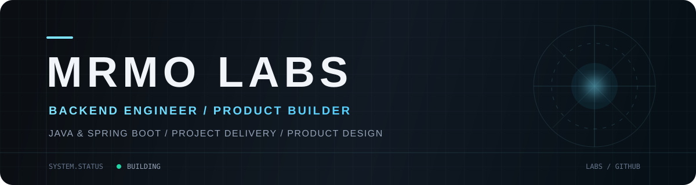

<p align="center">
  
</p>

<p align="center">
  <strong>Building tools that turn complex information into clear, interactive experiences.</strong><br />
  <sub>把复杂信息做成清晰、可交互、真正有用的工具。</sub>
</p>

<p align="center">
  
  
  
  
  
  
</p>

## About

I build visual tools, desktop applications, and experimental interfaces. I enjoy turning dense workflows and complex information into products that feel direct, legible, and satisfying to use.

- Building local-first desktop tools and rich interactive experiences
- Exploring AI-assisted product development and practical automation
- Caring about visual clarity, deliberate interaction, and maintainable systems

## Selected Work

<table>
  <tr>
    <td width="50%" valign="top">
      <h3><a href="https://github.com/Mrmo072/InkSight">InkSight</a></h3>
      <p>A modern reading and knowledge workspace that brings deep reading, mind mapping, and visual knowledge management together.</p>
      <code>Electron</code> <code>React</code> <code>Knowledge Tools</code>
    </td>
    <td width="50%" valign="top">
      <h3><a href="https://github.com/Mrmo072/YoRHa-HexFlow">YoRHa-HexFlow</a></h3>
      <p>A highly visual hexadecimal instruction orchestrator for binary protocol design, presented through a distinctive industrial interface.</p>
      <code>React</code> <code>FastAPI</code> <code>Protocol Design</code>
    </td>
  </tr>
  <tr>
    <td width="50%" valign="top">
      <h3><a href="https://github.com/Mrmo072/rogue-station">rogue-station</a></h3>
      <p>A cinematic 3D satellite visualization and inspection platform with a futuristic industrial visual system.</p>
      <code>React</code> <code>Three.js</code> <code>GSAP</code>
    </td>
    <td width="50%" valign="top">
      <h3>What I'm exploring</h3>
      <p>Local-first software, visual programming, intelligent desktop workflows, and interfaces that make technical systems easier to understand.</p>
      <code>Desktop</code> <code>Visualization</code> <code>AI Workflows</code>
    </td>
  </tr>
</table>

## How I Build

```text
clarity over clutter  ·  useful over ornamental  ·  local-first when practical
```

I like projects where interaction design, engineering, and visual systems reinforce each other. The goal is not just to make software work—it should also make the underlying idea easier to see.

---

<p align="center">
  <sub>Open to thoughtful feedback, technical discussion, and collaboration through the relevant project repositories.</sub>
</p>
